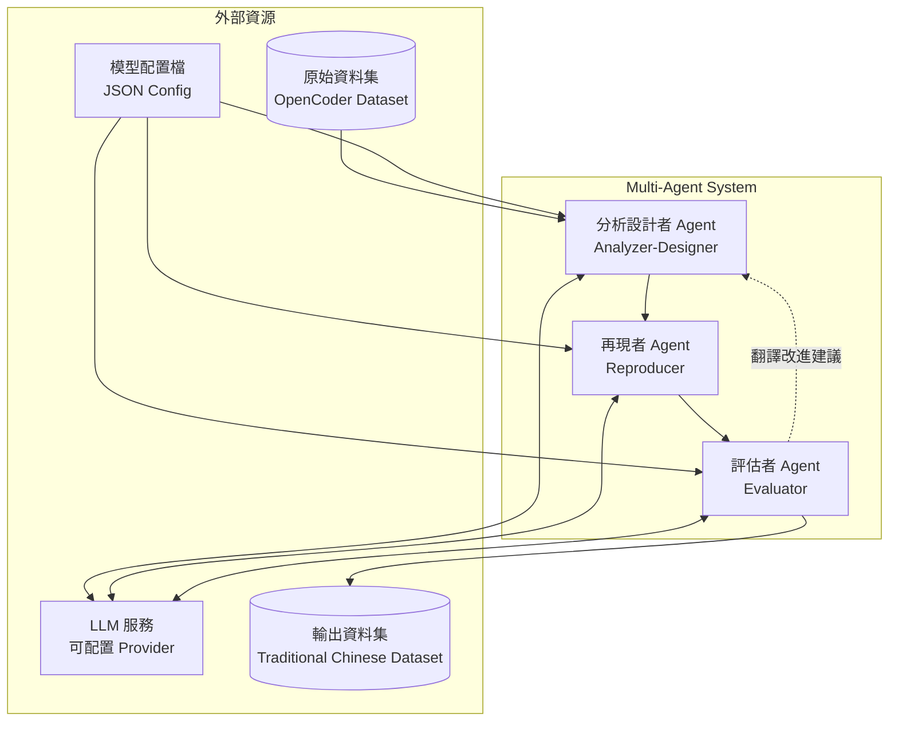
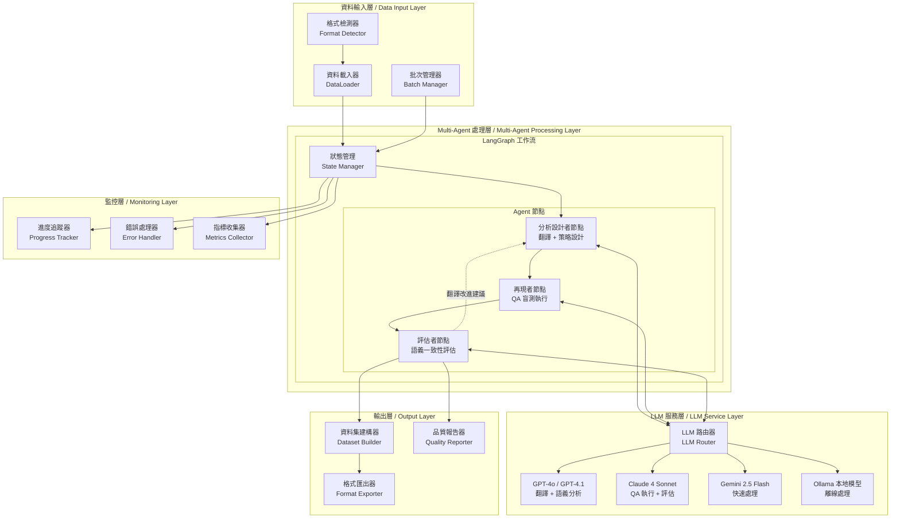
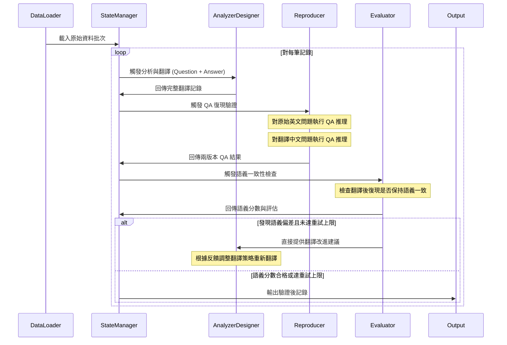
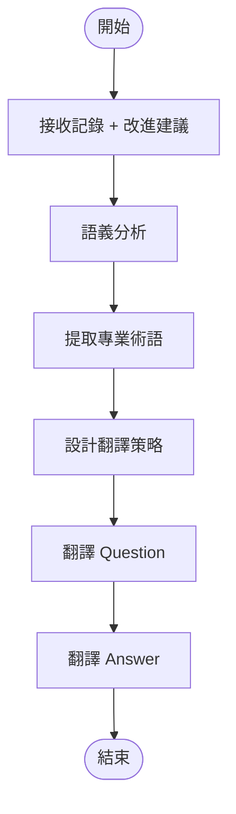
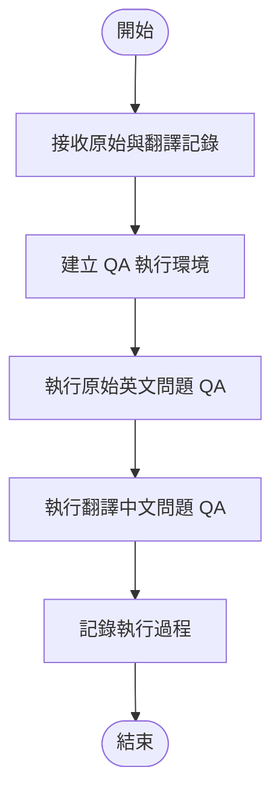
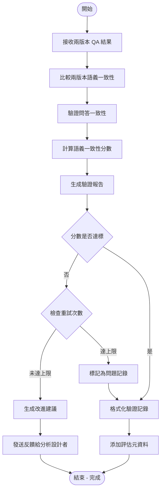

# 繁體中文程式碼問答資料集轉換系統設計文檔

## System Design Document for Traditional Chinese Code-QA Dataset Conversion (Multi-Agent)

### 目錄 / Table of Contents
1. [系統概述 / System Overview](#系統概述--system-overview)
2. [技術架構 / Technical Architecture](#技術架構--technical-architecture)
3. [Multi-Agent 架構 / Multi-Agent Architecture](#multi-agent-架構--multi-agent-architecture)
4. [功能需求 / Functional Requirements](#功能需求--functional-requirements)
5. [資料模型 / Data Models](#資料模型--data-models)
6. [系統架構圖 / System Architecture Diagram](#系統架構圖--system-architecture-diagram)
7. [Agent 工作流程圖 / Agent Workflow Diagrams](#agent-工作流程圖--agent-workflow-diagrams)
8. [組件規格 / Component Specifications](#組件規格--component-specifications)
9. [程式庫結構 / Repository Layout](#程式庫結構--repository-layout)

## 系統概述 / System Overview

本系統採用 Multi-Agent 架構，將英文程式碼問答資料集 (OpenCoder Dataset) 智慧轉換為繁體中文版本。系統透過三個專業化的 Agent 協作完成轉換與驗證：分析設計者進行語義分析與翻譯策略制定、再現者執行 QA 推理的盲測驗證、評估者比較兩版本回答的語義一致性。

**核心價值主張：**
- 透過盲測驗證確保翻譯品質
- 語義一致性評估取代傳統文字相似度
- 專業化 Agent 分工提升轉換準確性
- 支援多種 LLM Provider 的彈性配置架構
- 基於 QA 執行結果的品質評估機制
- 離線批次處理無需人工干預
- 後置 UI 介面支援品質檢閱與手動修正

**資料集規模：**
- Educational Instruct: 教育指導型資料
- Evolution Instruct: 進化式指令資料  
- MCEval Instruct: 多選題評估資料
- Package Instruct: 套件使用指導資料

## 技術架構 / Technical Architecture

| Layer          | 選用技術                                                                                                                | 對應套件                        | 版本要求     |
|----------------|--------------------------------------------------------------------------------------------------------------------|-------------------------------|----------|
| **AI 協調**      | **LangGraph 0.6.x** (Multi-Agent 工作流)<br>**LangChain 0.3.x** (Agent 基礎框架)                                        | `langgraph`, `langchain`      | >=0.6.0  |
| **LLM 服務**     | **多 Provider 支援** (OpenAI GPT-4o/4.1, Anthropic Claude 4, Google Gemini 2.5, Ollama 本地模型)<br>**LiteLLM** (統一 API 介面) | `langchain-openai`, `langchain-anthropic`, `langchain-google-genai`, `litellm` | >=0.3.0  |
| **資料處理**       | **Pandas 2.3.x** (資料操作)<br>**Datasets 4.x** (HuggingFace 資料集)<br>**NumPy 2.2.x** (數值計算)                         | `pandas`, `datasets`, `numpy` | >=2.0.0  |
| **程式碼分析**      | **Transformers 4.55.x** (程式碼語法分析)<br>**AST Parser** (語法樹解析)                                                      | `transformers`                | >=4.55.0 |
| **品質控制**       | **LLM 語義評估** (語義一致性分析)<br>**程式碼完整性檢查** (語法驗證)                                       | 內建實作                          | -        |
| **後置檢閱**       | **Streamlit/Gradio** (Web UI)<br>**JSON 檔案** (標記存儲)                                                              | `streamlit`                   | >=1.0.0  |
| **進度監控**       | **tqdm 4.67.x** (進度條)<br>**Logging** (日誌系統)                                                                        | `tqdm`                        | >=4.67.0 |
| **儲存格式**       | **JSON/JSONL** (本地檔案儲存)<br>**Arrow** (HuggingFace 相容)                                                           | `pyarrow`                     | >=10.0.0 |

## Multi-Agent 架構 / Multi-Agent Architecture

### Agent 角色定義



### Agent 職責規格

| Agent      | 核心職責                                                       | 輸入                        | 輸出                       | 可配置的 LLM Provider |
|------------|-----------------------------------------------------------|---------------------------|--------------------------|------------------|
| 分析設計者     | 1. 語義複雜度分析<br/>2. **Question 和 Answer 的序列式翻譯（先 Question 後 Answer）**<br/>3. 程式碼區塊識別與保護<br/>4. 基於 Prompt 的術語一致性管理              | 原始資料記錄 + 評估者改進建議            | 完整翻譯記錄（Question + Answer） | 可配置任意 Provider  |
| 再現者       | 1. 原始英文問題的 QA 推理執行<br/>2. 翻譯中文問題的 QA 推理執行<br/>3. 執行結果的結構化記錄<br/>4. 推理過程的詳細追蹤                          | 原始記錄 + 翻譯記錄             | 雙語 QA 執行結果 + 推理過程記錄           | 可配置任意 Provider  |
| 評估者       | 1. 雙語 QA 結果語義一致性分析<br/>2. 翻譯品質偏差檢測<br/>3. **翻譯改進建議生成**<br/>4. 重試機制管理<br/>5. 品質閾值控制               | 翻譯前後 QA 結果 + 執行過程記錄               | 語義一致性分數 + 翻譯改進建議 + 品質報告           | 可配置任意 Provider  |

**LLM Provider 支援：**
- OpenAI (GPT-4o, GPT-4.1)
- Anthropic (Claude 4 Sonnet)
- Google (Gemini 2.5 Flash)
- Ollama (本地模型如 llama3.1, qwen2.5, deepseek-coder)
- 其他支援 OpenAI API 格式的 Provider

#### LLM Provider 配置策略

```json
{
  "llm_providers": {
    "cloud_config": {
      "analyzer_designer": "openai/gpt-4o",
      "reproducer": "anthropic/claude-4-sonnet", 
      "evaluator": "openai/gpt-4o"
    },
    "alternative_cloud": {
      "analyzer_designer": "google/gemini-2.5-flash",
      "reproducer": "anthropic/claude-4-sonnet",
      "evaluator": "google/gemini-2.5-flash"
    },
    "local_config": {
      "analyzer_designer": "ollama/deepseek-coder:6.7b",
      "reproducer": "ollama/llama3.1:8b", 
      "evaluator": "ollama/qwen2.5:7b"
    }
  },
  "provider_configs": {
    "openai": {
      "api_key": "${OPENAI_API_KEY}",
      "base_url": "https://api.openai.com/v1",
      "max_retries": 3,
      "timeout": 60
    },
    "anthropic": {
      "api_key": "${ANTHROPIC_API_KEY}",
      "max_retries": 3,
      "timeout": 60
    },
    "ollama": {
      "base_url": "http://localhost:11434",
      "timeout": 120
    }
  },
  "monitoring": {
    "track_usage": true,
    "log_response_quality": true,
    "cost_tracking": true,
    "performance_metrics": true
  }
}
```

### 品質控制標準 / Quality Control Standards

#### 語義一致性評分標準 (0-10 分)
- **9-10 分**: 完全語義一致，翻譯保持原意且表達自然
- **7-8 分**: 高度一致，僅有輕微語言風格差異
- **5-6 分**: 基本一致，存在可接受的語義偏差
- **3-4 分**: 部分偏差，需要改進翻譯
- **0-2 分**: 嚴重偏差，翻譯錯誤或語義遺失

#### 品質閾值設定
- **自動通過閾值**: 語義一致性分數 >= 7.0
- **自動重試閾值**: 語義一致性分數 < 7.0
- **最大重試次數**: 每筆記錄最多重試 3 次
- **批次失敗率上限**: 單批次失敗率不得超過 15%

#### 程式碼完整性檢查
- **語法正確性**: 程式碼區塊必須保持原始語法結構
- **結構完整性驗證**: 程式碼片段在翻譯後仍應保持邏輯結構
- **註解翻譯品質**: 程式碼註解的翻譯準確性評估
- **API 名稱保護**: 函數名、變數名等不應被誤譯

#### 具體評分細則
- **程式碼完整性分數 (0-10分)**:
  - 10分: 程式碼語法完全正確，結構完整
  - 8-9分: 語法正確，可能有極少數格式問題
  - 6-7分: 語法基本正確，有少量非關鍵錯誤
  - 4-5分: 有明顯語法錯誤但邏輯可理解
  - 0-3分: 嚴重語法錯誤或程式碼結構損壞

- **翻譯自然度分數 (0-10分)**:
  - 9-10分: 翻譯自然流暢，符合繁體中文表達習慣
  - 7-8分: 翻譯通順，偶有用詞不夠自然
  - 5-6分: 翻譯可理解，但有明顯翻譯痕跡
  - 3-4分: 翻譯生硬，影響理解
  - 0-2分: 翻譯錯誤或無法理解

- **綜合品質分數計算公式**:
  ```
  overall_quality = (semantic_consistency_score * 0.5 + 
                    code_integrity_score * 0.3 + 
                    translation_naturalness * 0.2)
  ```

#### 語義一致性評分實作方法

- **LLM 語義相似度評估**: 使用 LLM 模型比較翻譯前後 QA 結果的語義相似度
- **關鍵資訊點比對**: 檢查重要概念、技術要點是否保持一致
- **邏輯推理步驟一致性**: 確認推理過程的邏輯結構相符
- **答案完整性檢查**: 驗證翻譯後答案涵蓋原始答案的所有重點

#### 重試觸發邏輯

- **語義一致性分數 < 7.0**: 自動觸發重試機制
- **重試時策略調整**: 根據評估者建議更新翻譯策略和 Prompt
- **最大重試限制**: 每筆記錄最多重試 3 次，超過則標記為問題記錄
- **批次容錯**: 單批次失敗率超過 15% 時暫停處理進行檢查

## 功能需求 / Functional Requirements

### 核心功能模組

| 模組            | 主要行為                                                                             | 優先級 | 估時 |
|---------------|----------------------------------------------------------------------------------|-----|----|
| **資料集載入**     | 自動識別 Arrow/JSONL 格式，批次載入多個資料集，記錄來源資訊                                           | P0  | 2d |
| **智慧翻譯**      | 保持程式碼完整性的上下文翻譯，基於 Prompt 的術語一致性翻譯，語法結構保持                                    | P0  | 5d |
| **程式碼保護**     | AST 解析識別程式碼區塊，程式碼語法驗證，程式碼註解翻譯                                                | P0  | 3d |
| **品質控制**      | LLM 語義一致性評估，翻譯品質評分，程式碼完整性檢查                                                   | P1  | 3d |
| **進度監控**      | 實時進度追蹤，錯誤記錄與恢復，處理狀態監控                                                        | P2  | 1d |
| **資料匯出**      | 多格式輸出支援，資料集重建，品質報告生成                                                       | P1  | 1d |

### 功能詳細規格

#### 1. 智慧翻譯引擎
- **上下文感知：** 基於指令-輸出對的完整上下文進行翻譯
- **程式碼區塊保護：** 自動識別並保護程式碼不被誤譯
- **Prompt 驅動術語處理：** 透過 Prompt 指導術語翻譯一致性
- **語法結構保持：** 保持原文的邏輯結構和格式

#### 2. 品質控制機制
- **LLM 語義評估：** 使用 LLM 進行語義一致性評估
- **程式碼完整性檢查：** 驗證程式碼語法和結構完整性
- **自動重試機制：** 品質不達標時自動重試
- **一致性檢查：** 翻譯風格和格式規範一致性

#### 3. 進度管理系統
- **流式批次處理：** 採用流式處理方式，每批次處理完成後釋放記憶體
- **斷點續傳：** 中斷後可從上次位置繼續
- **記憶體管理：** 避免一次載入整個資料集，動態管理記憶體使用
- **監控儀表板：** 實時顯示處理進度和品質指標

## 資料模型 / Data Models

### 常數定義

資料集類型、品質標準、Agent 角色等常數將在實作時定義。

### 資料類型定義

系統將定義以下核心資料結構：

#### 核心資料結構定義

```python
from enum import Enum
from dataclasses import dataclass, field
from typing import List, Optional
from typing_extensions import TypedDict, Annotated
from langgraph.graph import add_messages

class ProcessingStatus(Enum):
    """處理狀態枚舉"""
    PENDING = "pending"             # 等待處理
    PROCESSING = "processing"       # 處理中
    COMPLETED = "completed"         # 已完成
    FAILED = "failed"              # 處理失敗
    RETRY_NEEDED = "retry_needed"   # 需要重試
    SKIPPED = "skipped"            # 已跳過

class ComplexityLevel(Enum):
    """複雜度級別枚舉"""
    SIMPLE = "simple"
    MEDIUM = "medium"
    COMPLEX = "complex"

class ErrorType(Enum):
    """錯誤類型枚舉"""
    API_CONNECTION = "api_connection"
    TRANSLATION_QUALITY = "translation_quality"
    SYNTAX_ERROR = "syntax_error"
    TIMEOUT = "timeout"
    AUTHENTICATION = "authentication"
    RATE_LIMIT = "rate_limit"
    OTHER = "other"

class Language(Enum):
    """語言類型枚舉"""
    ENGLISH = "en"
    TRADITIONAL_CHINESE = "zh-tw"

class ProcessingStage(Enum):
    """處理階段枚舉"""
    DATA_LOADING = "data_loading"
    TRANSLATION = "translation"
    QA_EXECUTION = "qa_execution"
    EVALUATION = "evaluation"
    QUALITY_CHECK = "quality_check"
    OUTPUT_GENERATION = "output_generation"
    COMPLETED = "completed"

class CharacterEncoding(Enum):
    """字符編碼枚舉"""
    UTF8 = "utf-8"
    UTF16 = "utf-16"
    UTF32 = "utf-32"
    ASCII = "ascii"
    GBK = "gbk"
    BIG5 = "big5"

@dataclass
class RecordMetadata:
    """資料記錄元資料結構"""
    original_length: int           # 原始文本長度
    code_block_count: int         # 程式碼區塊數量
    complexity_level: ComplexityLevel # 複雜度級別
    language_hints: List[str]     # 涉及的程式語言
    topic_tags: List[str]         # 主題標籤
    estimated_difficulty: int     # 估計難度 1-10
    has_mathematical_content: bool # 是否包含數學內容
    character_encoding: CharacterEncoding # 字符編碼
    created_timestamp: float      # 創建時間戳

@dataclass
class ErrorRecord:
    """錯誤記錄結構"""
    error_type: ErrorType          # 錯誤類型
    error_message: str           # 錯誤訊息
    timestamp: float             # 發生時間戳
    retry_attempt: int           # 重試次數
    agent_name: str              # 發生錯誤的 Agent
    recovery_action: str         # 恢復措施

@dataclass
class ProcessingMetadata:
    """處理過程元資料結構"""
    total_processing_time: float    # 總處理時間（秒）
    translation_time: float         # 翻譯時間（秒）
    qa_execution_time: float        # QA執行時間（秒）
    evaluation_time: float          # 評估時間（秒）
    retry_count: int                # 重試次數
    models_used: List[str]          # 使用的模型列表
    api_calls_count: int            # API 呼叫次數
    tokens_consumed: int            # 消耗的 token 數
    processing_stage: ProcessingStage # 處理階段
    cost_estimation_usd: float      # 成本估算（美元）

@dataclass
class SourceInfo:
    """來源資料集資訊結構"""
    dataset_name: str              # 資料集名稱
    dataset_version: str           # 資料集版本
    original_index: str            # 在原始資料集中的索引
    subset_name: str               # 子集名稱（如 'train', 'test'）
    download_url: str              # 下載來源 URL
    license_info: str              # 授權資訊
    collection_date: str           # 收集日期

@dataclass
class OriginalRecord:
    """原始資料記錄結構"""
    id: str
    instruction: str        # 原始英文問題
    output: str            # 原始英文答案  
    source_dataset: str    # 來源資料集名稱
    metadata: RecordMetadata

@dataclass
class TranslationResult:
    """翻譯結果結構"""
    translated_instruction: str    # 翻譯後問題
    translated_output: str         # 翻譯後答案
    confidence_score: float        # 翻譯信心分數
    processing_time: float         # 處理時間（秒）

@dataclass
class QAExecutionResult:
    """QA 執行結果"""
    question: str                  # 輸入問題
    answer: str                    # LLM 生成答案
    language: Language             # 問題語言
    reasoning_steps: List[str]     # 推理步驟
    execution_time: float          # 執行時間
    model_used: str                # 使用的模型

@dataclass
class QualityAssessment:
    """品質評估結果"""
    semantic_consistency_score: float     # 語義一致性分數 (0-10)
    code_integrity_score: float           # 程式碼完整性分數 (0-10)
    translation_naturalness: float        # 翻譯自然度分數 (0-10)
    overall_quality: float                # 綜合品質分數 (0-10)
    improvement_suggestions: List[str]    # 改進建議
    requires_retry: bool                  # 是否需要重試
    
@dataclass
class ProcessingState:
    """LangGraph 狀態管理"""
    current_record: OriginalRecord
    translation_result: Optional[TranslationResult]
    original_qa_result: Optional[QAExecutionResult]  
    translated_qa_result: Optional[QAExecutionResult]
    quality_assessment: Optional[QualityAssessment]
    retry_count: int = 0
    processing_status: ProcessingStatus = ProcessingStatus.PENDING
    error_history: List[ErrorRecord] = field(default_factory=list)
    improvement_suggestions: List[str] = field(default_factory=list)
    
@dataclass
class FinalRecord:
    """最終輸出記錄"""
    id: str
    original_instruction: str
    original_output: str
    translated_instruction: str
    translated_output: str
    quality_metadata: QualityAssessment
    processing_metadata: ProcessingMetadata  # 包含處理時間、重試次數、使用的模型等
    source_info: SourceInfo         # 來源資料集資訊
    validation_notes: List[str] = field(default_factory=list)  # 驗證備註

@dataclass
class CostEstimation:
    """成本估算結構"""
    openai_cost_usd: float         # OpenAI 成本
    anthropic_cost_usd: float      # Anthropic 成本
    google_cost_usd: float         # Google 成本
    ollama_cost_usd: float         # Ollama 成本（通常為0）
    total_cost_usd: float          # 總成本
    
@dataclass
class ErrorSummary:
    """錯誤統計結構"""
    api_connection_errors: int     # API 連接錯誤次數
    translation_quality_issues: int # 翻譯品質問題次數
    syntax_errors: int             # 語法錯誤次數
    timeout_errors: int            # 超時錯誤次數
    authentication_errors: int     # 認證錯誤次數
    rate_limit_errors: int         # 速率限制錯誤次數
    other_errors: int              # 其他錯誤次數

@dataclass  
class BatchProcessingResult:
    """批次處理結果統計"""
    total_records: int
    successful_records: int
    failed_records: int
    average_quality_score: float
    processing_time_seconds: float
    cost_estimation: CostEstimation  # 各 Provider 的成本估算
    error_summary: ErrorSummary      # 錯誤類型統計
```

## 系統架構圖 / System Architecture Diagram



## Agent 工作流程圖 / Agent Workflow Diagrams

### 1. 整體工作流程


### 2. 分析設計者 Agent 流程

### 3. 再現者 Agent 流程


### 4. 評估者 Agent 流程


## 組件規格 / Component Specifications

### 1. DataLoader 組件

**功能**: 資料集載入與格式檢測
- 支援 Arrow/JSONL/CSV 格式自動檢測
- 批次載入機制
- 資料綱要驗證
- 錯誤恢復機制

### 2. AnalyzerDesigner Agent 組件

**職責**: 語義分析與序列式翻譯執行
- 透過 LLM 進行語義複雜度分析
- 使用自然語言理解識別程式碼區塊
- **序列式翻譯**: 先翻譯 Question，再基於翻譯後的 Question 翻譯 Answer，確保上下文一致性
- 基於 Prompt 的術語一致性管理（不維護專業詞彙字典）
- 根據 Evaluator 反饋調整翻譯 Prompt

### 3. Reproducer Agent 組件

**職責**: QA 推理與語義比較（純文字處理）
- 對翻譯前（原始英文）的問題進行 QA 推理
- 對翻譯後（繁體中文）的問題進行 QA 推理  
- 生成兩個版本的文字回答結果
- 提供推理過程的詳細記錄
- 確保在相同邏輯下進行公平比較
- 記錄推理時間和思考步驟
- **注意**: 此處的 QA 執行僅指 LLM 文字推理，不涉及程式碼實際執行

### 4. Evaluator Agent 組件

**職責**: 語義一致性檢查與翻譯指導
- 檢查翻譯後 LLM 復現是否保持與翻譯前近似的語義輸出
- 比較翻譯前後 QA 執行結果的語義一致性
- 評估兩個回答的語義偏差程度
- 分析翻譯過程中可能的語義遺失或曲解
- 標記語義分數過低的問題記錄
- **翻譯改進指導**: 當發現語義偏差時，直接向 AnalyzerDesigner Agent 提供具體的翻譯改進建議
- 管理最大重試次數限制，避免無限循環
- 生成品質評估報告和翻譯優化建議

## 程式庫結構 / Repository Layout

```
project-root/
├── pyproject.toml
├── uv.lock
├── main.py  # 主程式入口
├── README.md
├── LICENSE
│
├── docs/
│   ├── system-design.md        # 本文檔
│   ├── agent-specifications.md # Agent 詳細規格
│   └── api-documentation.md    # API 文檔
│
├── data/                               # 資料目錄
│   ├── dataset_sample.csv              # 樣本資料
│   ├── opencoder_dataset_*/            # 原始資料集
│   ├── processed_opencoder_dataset_*/  # 處理後資料集
│   └── quality_reports/                # 品質報告
│
├── scripts/
│   ├── download_dataset.py     # 資料集下載腳本
│   └── run_conversion.py       # 轉換執行腳本
│
└── src/
    ├── __init__.py
    │
    ├── constants/
    │   ├── __init__.py
    │   ├── dataset.py          # 資料集相關常數
    │   ├── agents.py           # Agent 相關常數
    │   ├── quality.py          # 品質標準常數
    │   └── llm.py              # LLM 服務常數
    │
    ├── models/
    │   ├── __init__.py
    │   ├── dataset.py          # 資料集類型定義
    │   ├── quality.py          # 品質評估類型
    │   └── workflow.py         # 工作流狀態類型
    │
    ├── workflow/
    │   ├── __init__.py
    │   ├── state.py            # LangGraph 狀態管理 (與狀態定義)
    │   ├── graph.py            # LangGraph 工作流定義
    │   ├── nodes/              # 工作流節點模組
    │   │   ├── __init__.py
    │   │   ├── analyzer_designer_node.py  # 分析設計者節點
    │   │   ├── reproducer_node.py         # 再現者節點
    │   │   └── evaluator_node.py          # 評估者節點
    │   └── __tests__/
    │       ├── test_state.py
    │       ├── test_graph.py
    │       └── nodes/
    │           ├── test_analyzer_designer_node.py
    │           ├── test_reproducer_node.py
    │           └── test_evaluator_node.py
    │
    ├── services/
    │   ├── __init__.py
    │   ├── llm_service.py      # LLM 服務整合
    │   ├── data_loader.py      # 資料載入服務
    │   └── __tests__/
    │       ├── test_llm_service.py
    │       └── test_data_loader.py
    │
    ├── utils/
    │   ├── __init__.py
    │   ├── format_converter.py # 資料格式轉換工具
    │   └── __tests__/
    │       └── test_format_converter.py
    │
    ├── core/
    │   ├── __init__.py
    │   ├── dataset_manager.py  # 資料集管理核心
    │   └── __tests__/
    │       └── test_dataset_manager.py
    │
    └── config/
        ├── __init__.py
        ├── settings.py         # 系統設定
        ├── llm_config.py       # LLM 服務配置
        ├── agent_models.json   # Agent 模型配置檔
        └── logging_config.py   # 日誌配置
```

## 工作流節點模組化設計 / Workflow Node Modularization

### 節點模組架構

每個 Agent 都有獨立的節點檔案，便於維護和測試：

- **analyzer_designer_node.py**: 分析設計者工作流節點，負責翻譯
- **reproducer_node.py**: QA 執行節點，負責盲測驗證  
- **evaluator_node.py**: 語義評估節點，負責一致性分析

### 節點設計原則

1. **統一介面**: 每個節點都有一致的處理介面
2. **狀態管理**: 透過 ProcessingState 在節點間傳遞資料
3. **盲測驗證**: 再現者節點確保公平的 QA 執行比較
4. **語義評估**: 評估者基於 QA 結果進行語義一致性分析
5. **LLM 整合**: 直接與 LLM 服務整合，無需額外工具層

## 開發規範 / Development Standards

### 1. Agent 設計原則

#### 單一職責原則
每個 Agent 專注於特定的任務領域，避免功能重疊：
- AnalyzerDesigner Agent: 專注於分析和策略設計
- Reproducer Agent: 專注於翻譯執行  
- Evaluator Agent: 專注於品質評估和控制

#### Agent 通信規範
- 使用明確定義的資料結構進行 Agent 間通信
- 所有 Agent 輸入輸出都要有類型標註
- 狀態管理統一透過 LangGraph State

### 2. 品質保證規範

#### 測試覆蓋率要求
- 核心 Agent 測試覆蓋率 >= 90%
- 工具函數測試覆蓋率 >= 95%
- 整合測試覆蓋主要工作流程


#### 錯誤處理與重試機制詳細規格

**錯誤分類與處理策略：**
- **API 連線錯誤** (網路超時、認證失敗): 指數退避重試，最多 5 次
- **語義品質不佳** (分數 < 7.0): 自動重試，最多 3 次，每次重試更新翻譯策略  
- **程式碼語法錯誤**: 自動修復 + 人工標記
- **系統性錯誤** (模型異常): 記錄錯誤，手動處理

**斷點續傳機制：** 
- 每 100 筆記錄自動儲存進度
- 支援從任意中斷點恢復處理
- 失敗記錄單獨隔離，不影響後續處理

**記憶體管理策略：**
- **流式處理**: 避免一次載入整個資料集
- **批次記憶體釋放**: 每批次處理完成後立即釋放記憶體
- **動態批次大小**: 根據可用記憶體調整批次大小（預設 100 筆/批次）

**重試邏輯配置：**
```python
RetryPolicy = {
    "max_retries": {
        "api_errors": 5,
        "quality_issues": 3,  # 語義一致性分數 < 7.0
        "syntax_errors": 2
    },
    "backoff_strategy": {
        "api_errors": "exponential",  # 1s, 2s, 4s, 8s, 16s
        "quality_issues": "immediate",
        "syntax_errors": "immediate"
    }
}
```

### 3. LLM 使用規範

#### Prompt 設計原則
- 使用結構化 Prompt 模板
- 包含清楚的任務描述和預期輸出格式
- 提供少樣本學習範例
- 針對繁體中文程式碼問答場景優化
- **術語一致性透過 Prompt 驅動**: 在 Prompt 中提供術語翻譯指導，不維護專業詞彙字典

#### LLM 服務管理
- 實作重試機制和錯誤處理
- 監控 API 使用量和成本
- 每個 Agent 可配置不同的模型
- **Provider 配置**: 透過配置檔指定各 Agent 使用的 LLM 模型

### 4. Node 節點實作規範

#### 工作流狀態管理
- **使用 TypedDict 定義狀態**: 所有工作流狀態必須在 `state.py` 中使用 TypedDict 定義
- **統一狀態介面**: 所有 Node 節點必須遵循 `state -> state` 的函數簽名
- **彈性狀態更新**: Node 節點可以使用 `state.update({})` 批次更新或直接修改狀態屬性，兩種方式都是允許的

#### Node 節點設計原則
```python
# 範例：正確的 Node 節點實作方式

from typing_extensions import TypedDict
from langgraph.graph import add_messages

# 在 state.py 中定義工作流狀態
class WorkflowState(TypedDict):
    """工作流狀態定義"""
    current_record: OriginalRecord
    translation_result: Optional[TranslationResult]
    original_qa_result: Optional[QAExecutionResult]
    translated_qa_result: Optional[QAExecutionResult]
    quality_assessment: Optional[QualityAssessment]
    retry_count: int
    processing_status: ProcessingStatus
    error_history: Annotated[List[ErrorRecord], add_messages]
    improvement_suggestions: List[str]

# Node 節點實作範例
def analyzer_designer_node(state: WorkflowState) -> WorkflowState:
    """分析設計者節點 - 負責翻譯任務"""
    
    # 處理邏輯...
    translation_result = perform_translation(state["current_record"])
    
    # 可以使用 state.update() 批次更新
    state.update({
        "translation_result": translation_result,
        "processing_status": ProcessingStatus.PROCESSING
    })
    
    return state

def reproducer_node(state: WorkflowState) -> WorkflowState:
    """再現者節點 - 負責 QA 執行"""
    
    # 處理邏輯...
    original_qa = execute_qa(state["current_record"])
    translated_qa = execute_qa_translated(state["translation_result"])
    
    # 也可以直接修改狀態屬性
    state["original_qa_result"] = original_qa
    state["translated_qa_result"] = translated_qa
    state["processing_status"] = ProcessingStatus.PROCESSING
    
    return state
```

#### 強制性實作要求

1. **類型安全**: 所有 Node 函數必須有明確的類型標註
2. **完整狀態返回**: 必須返回完整的 TypedDict 狀態物件
3. **直接狀態修改**: 可以直接修改狀態物件的屬性，LangGraph 會處理狀態追蹤
4. **錯誤處理**: 每個 Node 必須妥善處理異常並更新錯誤狀態
5. **日誌記錄**: 每個 Node 的關鍵操作必須記錄日誌

#### 禁止的實作方式
```python
# ❌ 錯誤：沒有類型標註
def bad_node(state):  # 缺少類型標註
    state["result"] = "something"
    return state

# ❌ 錯誤：沒有返回狀態
def bad_node2(state: WorkflowState):  # 沒有返回狀態
    state["processing_status"] = ProcessingStatus.COMPLETED
    # 缺少 return state

# ❌ 錯誤：返回部分狀態
def bad_node3(state: WorkflowState) -> dict:  # 錯誤的返回類型
    return {
        "translation_result": result,
        "processing_status": ProcessingStatus.COMPLETED,
    }  # 缺少其他必要欄位
```

#### 正確的實作方式
```python
# ✅ 正確：使用 state.update() 批次更新
def good_node_update(state: WorkflowState) -> WorkflowState:
    """使用 state.update() 的範例"""
    try:
        # 執行節點邏輯
        result = process_data(state["current_record"])
        
        # 使用 state.update() 批次更新狀態
        state.update({
            "translation_result": result,
            "processing_status": ProcessingStatus.COMPLETED
        })
        
        return state
        
    except Exception as e:
        # 錯誤處理
        error_record = ErrorRecord(
            error_type=ErrorType.OTHER,
            error_message=str(e),
            timestamp=time.time(),
            retry_attempt=state.get("retry_count", 0),
            agent_name="analyzer_designer",
            recovery_action="logged_error"
        )
        
        # 使用 state.update() 更新錯誤狀態
        state.update({
            "processing_status": ProcessingStatus.FAILED,
            "error_history": state["error_history"] + [error_record]
        })
        
        return state

# ✅ 正確：直接修改狀態屬性
def good_node_direct(state: WorkflowState) -> WorkflowState:
    """直接修改狀態的範例"""
    try:
        # 執行節點邏輯
        result = process_data(state["current_record"])
        
        # 直接修改狀態屬性（同樣是正確的）
        state["translation_result"] = result
        state["processing_status"] = ProcessingStatus.COMPLETED
        
        return state
        
    except Exception as e:
        # 直接修改狀態處理錯誤
        state["processing_status"] = ProcessingStatus.FAILED
        state["error_history"].append(
            ErrorRecord(
                error_type=ErrorType.OTHER,
                error_message=str(e),
                timestamp=time.time(),
                retry_attempt=state.get("retry_count", 0),
                agent_name="analyzer_designer",
                recovery_action="logged_error"
            )
        )
        
        return state

# ✅ 正確：複雜狀態更新範例
def evaluator_node(state: WorkflowState) -> WorkflowState:
    """評估者節點 - 展示複雜狀態更新"""
    
    quality_result = evaluate_translation_quality(
        state["original_qa_result"], 
        state["translated_qa_result"]
    )
    
    # 根據評估結果決定下一步
    if quality_result.overall_quality >= 7.0:
        # 品質達標 - 可選擇使用 update 或直接修改
        state.update({
            "quality_assessment": quality_result,
            "processing_status": ProcessingStatus.COMPLETED,
            "improvement_suggestions": []
        })
    else:
        # 品質不達標 - 需要重試（使用直接修改）
        retry_count = state.get("retry_count", 0) + 1
        
        if retry_count <= 3:
            # 直接修改狀態
            state["quality_assessment"] = quality_result
            state["processing_status"] = ProcessingStatus.RETRY_NEEDED
            state["retry_count"] = retry_count
            state["improvement_suggestions"] = quality_result.improvement_suggestions
        else:
            # 超過重試次數，標記為失敗
            state["quality_assessment"] = quality_result
            state["processing_status"] = ProcessingStatus.FAILED
            state["retry_count"] = retry_count
    
    return state
```

#### 狀態管理最佳實踐

1. **狀態分片**: 大型狀態應該分解為邏輯相關的小片段
2. **預設值處理**: 使用 `state.get(key, default)` 安全存取狀態
3. **狀態驗證**: 在關鍵節點驗證狀態的完整性和正確性
4. **追蹤機制**: 重要狀態變更必須記錄到 `error_history` 或專用的追蹤欄位

這種設計確保：
- **類型安全**: TypedDict 提供編譯時類型檢查
- **可追蹤性**: 所有狀態變更都可以被 LangGraph 追蹤和調試
- **模組化**: 每個 Node 只關注自己的職責和狀態更新
